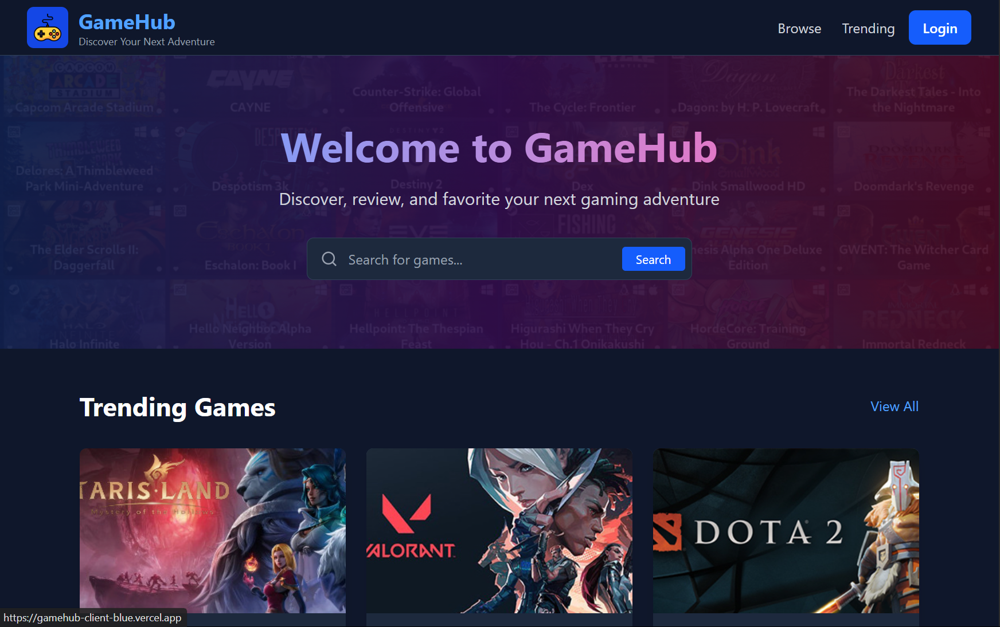

  
  <h1>GameHub Backend API</h1>
  
<strong>Powering the Ultimate Gaming Discovery Platform</strong>

  
  
  
  

  

## 🚀 The Engine Behind GameHub

A robust, scalable Node.js API that powers the GameHub gaming discovery platform with enterprise-grade features:

- 🔐 **Secure Google OAuth** - Seamless authentication with JWT tokens
- 🎮 **Smart Game Discovery** - Advanced search and filtering capabilities
- ⭐ **Personal Collections** - User favorites and review management
- 📊 **External API Integration** - Real-time game data synchronization
- 🛡️ **Production Ready** - Enterprise security and performance optimizations

## ⚡ Built for Scale

  <table>
    <tr>
      <td align="center"><b>🔥 Fast</b> Optimized queries & caching</td>
      <td align="center"><b>🔒 Secure</b> Enterprise-grade protection</td>
      <td align="center"><b>📈 Scalable</b> MongoDB & rate limiting</td>
    </tr>
  </table>

## 💻 Modern Stack

  
  
  
  
  

## 🎯 Perfect For Developers Who Want:

- 🚀 **Full-stack Experience** - Complete backend implementation examples
- 🔐 **Authentication Mastery** - OAuth 2.0 and JWT best practices
- 📊 **API Design** - RESTful endpoints with proper validation
- 🧪 **Testing Excellence** - Comprehensive test coverage examples
- 🛡️ **Security Expertise** - Production-ready security implementations

## 🌟 Get Started in Minutes!

  
<strong>Clone → Install → Configure → Run</strong>

  
  <code>npm install && npm run dev</code>

Perfect for learning modern backend development, contributing to open source, or building your own gaming platform!

---

  
GameHub Backend is open source under the <a href="LICENSE">Creative Commons Legal Code License</a>

  
  <a href="#top">Back to top ⬆️</a>

